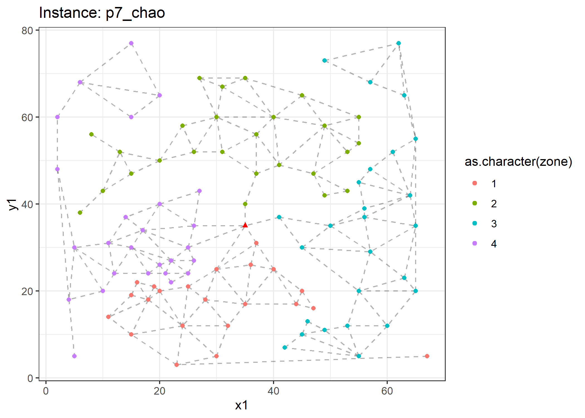
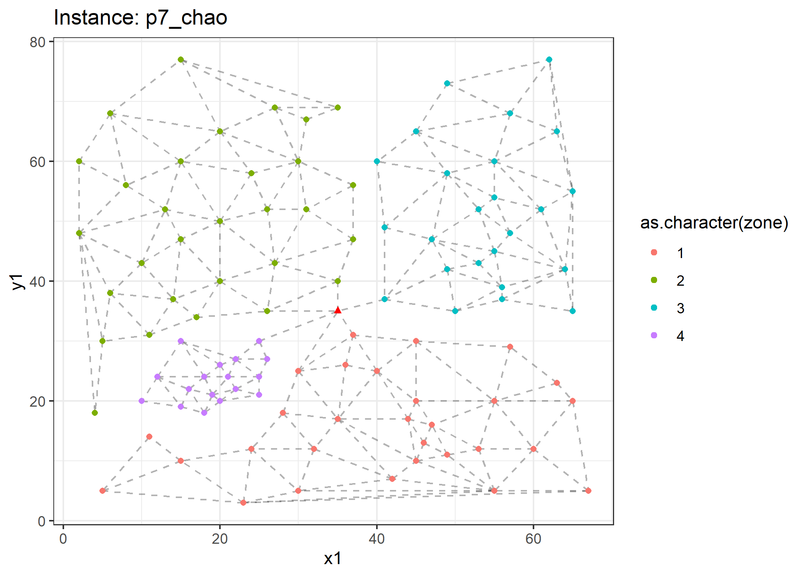

<!-- README.md is generated from README.Rmd. Please edit that file -->

# Dynamic Zoning

<!-- badges: start -->

[](https://www.repostatus.org/#active)
<!-- badges: end -->

The goal of dz is to showcase algorithms developed to handle dynamic
zoning applications for the team-orienteering problem.

## Installation

You can install the development version of dz from
[GitHub](https://github.com/) with:

``` r
# install.packages("devtools")
devtools::install_github("Rosenkrands/dz")
```

We can then load the library with the following command:

``` r
library(dz)
```

## Test instances

There are 7 seven test instances included in the package. They can be
accessed with `dz::test_instances`.

``` r
length(test_instances)
#> [1] 7
```

``` r
inst <- test_instances$p7_chao 
plot(inst, delaunay = T, voronoi = F)
```


## Clustering

With the `clustering` function we are able to decompose an instance into
a number of disjoint sets (disregarding the source node).

As of now there are two methods to perform the clustering; the greedy
approach and a local search approach. Below we can see the resulting
clusters from the greedy approach.

``` r
clust_gr <- clustering(
  inst = inst,
  k = 4,
  cluster_method = "greedy"
)
#> unassigned points: 100 unassigned points: 99 unassigned points: 98 unassigned points: 97 unassigned points: 96 unassigned points: 95 unassigned points: 94 unassigned points: 93 unassigned points: 92 unassigned points: 91 unassigned points: 90 unassigned points: 89 unassigned points: 88 unassigned points: 87 unassigned points: 86 unassigned points: 85 unassigned points: 84 unassigned points: 83 unassigned points: 82 unassigned points: 81 unassigned points: 80 unassigned points: 79 unassigned points: 78 unassigned points: 77 unassigned points: 76 unassigned points: 75 unassigned points: 74 unassigned points: 73 unassigned points: 72 unassigned points: 71 unassigned points: 70 unassigned points: 69 unassigned points: 68 unassigned points: 67 unassigned points: 66 unassigned points: 65 unassigned points: 64 unassigned points: 63 unassigned points: 62 unassigned points: 61 unassigned points: 60 unassigned points: 59 unassigned points: 58 unassigned points: 57 unassigned points: 56 unassigned points: 55 unassigned points: 54 unassigned points: 53 unassigned points: 52 unassigned points: 51 unassigned points: 50 unassigned points: 49 unassigned points: 48 unassigned points: 47 unassigned points: 46 unassigned points: 45 unassigned points: 44 unassigned points: 43 unassigned points: 42 unassigned points: 41 unassigned points: 40 unassigned points: 39 unassigned points: 38 unassigned points: 37 unassigned points: 36 unassigned points: 35 unassigned points: 34 unassigned points: 33 unassigned points: 32 unassigned points: 31 unassigned points: 30 unassigned points: 29 unassigned points: 28 unassigned points: 27 unassigned points: 26 unassigned points: 25 unassigned points: 24 unassigned points: 23 unassigned points: 22 unassigned points: 21 unassigned points: 20 unassigned points: 19 unassigned points: 18 unassigned points: 17 unassigned points: 16 unassigned points: 15 unassigned points: 14 unassigned points: 13 unassigned points: 12 unassigned points: 12 unassigned points: 11 unassigned points: 10 unassigned points: 9 unassigned points: 9 unassigned points: 8 unassigned points: 7 unassigned points: 6 unassigned points: 6 unassigned points: 5 unassigned points: 4 unassigned points: 3 unassigned points: 3 unassigned points: 2 unassigned points: 1 unassigned points: 0
#> all done!

plot(clust_gr)
```



The local search approach tries to improve on the greedy approach using
an insertion operator. Resulting clusters from the local search approach
are shown below.

``` r
clust_ls <- clustering(
  inst = inst,
  k = 4,
  cluster_method = "local_search"
)
#> Performing the initial greedy clustering
#> unassigned points: 100 unassigned points: 99 unassigned points: 98 unassigned points: 97 unassigned points: 96 unassigned points: 95 unassigned points: 94 unassigned points: 93 unassigned points: 92 unassigned points: 91 unassigned points: 90 unassigned points: 89 unassigned points: 88 unassigned points: 87 unassigned points: 86 unassigned points: 85 unassigned points: 84 unassigned points: 83 unassigned points: 82 unassigned points: 81 unassigned points: 80 unassigned points: 79 unassigned points: 78 unassigned points: 77 unassigned points: 76 unassigned points: 75 unassigned points: 74 unassigned points: 73 unassigned points: 72 unassigned points: 71 unassigned points: 70 unassigned points: 69 unassigned points: 68 unassigned points: 67 unassigned points: 66 unassigned points: 65 unassigned points: 64 unassigned points: 63 unassigned points: 62 unassigned points: 61 unassigned points: 60 unassigned points: 59 unassigned points: 58 unassigned points: 57 unassigned points: 56 unassigned points: 55 unassigned points: 54 unassigned points: 53 unassigned points: 52 unassigned points: 51 unassigned points: 50 unassigned points: 49 unassigned points: 48 unassigned points: 47 unassigned points: 46 unassigned points: 45 unassigned points: 44 unassigned points: 43 unassigned points: 42 unassigned points: 41 unassigned points: 40 unassigned points: 39 unassigned points: 38 unassigned points: 37 unassigned points: 36 unassigned points: 35 unassigned points: 34 unassigned points: 33 unassigned points: 32 unassigned points: 31 unassigned points: 30 unassigned points: 29 unassigned points: 28 unassigned points: 27 unassigned points: 26 unassigned points: 25 unassigned points: 24 unassigned points: 23 unassigned points: 22 unassigned points: 21 unassigned points: 20 unassigned points: 19 unassigned points: 18 unassigned points: 17 unassigned points: 16 unassigned points: 15 unassigned points: 14 unassigned points: 13 unassigned points: 12 unassigned points: 12 unassigned points: 11 unassigned points: 10 unassigned points: 9 unassigned points: 9 unassigned points: 8 unassigned points: 7 unassigned points: 6 unassigned points: 6 unassigned points: 5 unassigned points: 4 unassigned points: 3 unassigned points: 3 unassigned points: 2 unassigned points: 1 unassigned points: 0
#> all done!
#> Starting the local search
#> Inital objective is: 0.2520158 
#> 
#> candidates left: 91 candidates left: 90 candidates left: 89 candidates left: 88 candidates left: 87 candidates left: 86 candidates left: 85 candidates left: 84 candidates left: 83 candidates left: 82 candidates left: 81 candidates left: 80 candidates left: 79 candidates left: 78 candidates left: 77 candidates left: 76 candidates left: 75 candidates left: 74 candidates left: 73 candidates left: 72 candidates left: 71 candidates left: 70 candidates left: 69 candidates left: 68 candidates left: 67 candidates left: 66 candidates left: 65 candidates left: 64 candidates left: 63 candidates left: 62 candidates left: 61 candidates left: 60 candidates left: 59 candidates left: 58 candidates left: 57 candidates left: 56 candidates left: 55 candidates left: 54 candidates left: 53 candidates left: 52 candidates left: 51 candidates left: 50 candidates left: 49 candidates left: 48 candidates left: 47 candidates left: 46 candidates left: 45 candidates left: 44 candidates left: 43 candidates left: 42 candidates left: 41 candidates left: 40 candidates left: 39 candidates left: 38 candidates left: 37 candidates left: 36 candidates left: 35 candidates left: 34 candidates left: 33 candidates left: 32 candidates left: 31 candidates left: 30 candidates left: 29 candidates left: 28 candidates left: 27 candidates left: 26 candidates left: 25 candidates left: 24 candidates left: 23 candidates left: 22 candidates left: 21 candidates left: 20 candidates left: 19 candidates left: 18 candidates left: 17 candidates left: 16 candidates left: 15 candidates left: 14 candidates left: 13 candidates left: 12 candidates left: 11 candidates left: 10 candidates left: 9 candidates left: 8 candidates left: 7 candidates left: 6 candidates left: 5 candidates left: 4 candidates left: 3 candidates left: 2 candidates left: 1 candidates left: 0 objective: 0.2469968   iteration: 1
#> candidates left: 87 candidates left: 86 candidates left: 85 candidates left: 84 candidates left: 83 candidates left: 82 candidates left: 81 candidates left: 80 candidates left: 79 candidates left: 78 candidates left: 77 candidates left: 76 candidates left: 75 candidates left: 74 candidates left: 73 candidates left: 72 candidates left: 71 candidates left: 70 candidates left: 69 candidates left: 68 candidates left: 67 candidates left: 66 candidates left: 65 candidates left: 64 candidates left: 63 candidates left: 62 candidates left: 61 candidates left: 60 candidates left: 59 candidates left: 58 candidates left: 57 candidates left: 56 candidates left: 55 candidates left: 54 candidates left: 53 candidates left: 52 candidates left: 51 candidates left: 50 candidates left: 49 candidates left: 48 candidates left: 47 candidates left: 46 candidates left: 45 candidates left: 44 candidates left: 43 candidates left: 42 candidates left: 41 candidates left: 40 candidates left: 39 candidates left: 38 candidates left: 37 candidates left: 36 candidates left: 35 candidates left: 34 candidates left: 33 candidates left: 32 candidates left: 31 candidates left: 30 candidates left: 29 candidates left: 28 candidates left: 27 candidates left: 26 candidates left: 25 candidates left: 24 candidates left: 23 candidates left: 22 candidates left: 21 candidates left: 20 candidates left: 19 candidates left: 18 candidates left: 17 candidates left: 16 candidates left: 15 candidates left: 14 candidates left: 13 candidates left: 12 candidates left: 11 candidates left: 10 candidates left: 9 candidates left: 8 candidates left: 7 candidates left: 6 candidates left: 5 candidates left: 4 candidates left: 3 candidates left: 2 candidates left: 1 candidates left: 0 objective: 0.2439284   iteration: 2
#> candidates left: 85 candidates left: 84 candidates left: 83 candidates left: 82 candidates left: 81 candidates left: 80 candidates left: 79 candidates left: 78 candidates left: 77 candidates left: 76 candidates left: 75 candidates left: 74 candidates left: 73 candidates left: 72 candidates left: 71 candidates left: 70 candidates left: 69 candidates left: 68 candidates left: 67 candidates left: 66 candidates left: 65 candidates left: 64 candidates left: 63 candidates left: 62 candidates left: 61 candidates left: 60 candidates left: 59 candidates left: 58 candidates left: 57 candidates left: 56 candidates left: 55 candidates left: 54 candidates left: 53 candidates left: 52 candidates left: 51 candidates left: 50 candidates left: 49 candidates left: 48 candidates left: 47 candidates left: 46 candidates left: 45 candidates left: 44 candidates left: 43 candidates left: 42 candidates left: 41 candidates left: 40 candidates left: 39 candidates left: 38 candidates left: 37 candidates left: 36 candidates left: 35 candidates left: 34 candidates left: 33 candidates left: 32 candidates left: 31 candidates left: 30 candidates left: 29 candidates left: 28 candidates left: 27 candidates left: 26 candidates left: 25 candidates left: 24 candidates left: 23 candidates left: 22 candidates left: 21 candidates left: 20 candidates left: 19 candidates left: 18 candidates left: 17 candidates left: 16 candidates left: 15 candidates left: 14 candidates left: 13 candidates left: 12 candidates left: 11 candidates left: 10 candidates left: 9 candidates left: 8 candidates left: 7 candidates left: 6 candidates left: 5 candidates left: 4 candidates left: 3 candidates left: 2 candidates left: 1 candidates left: 0 objective: 0.2416107   iteration: 3
#> candidates left: 84 candidates left: 83 candidates left: 82 candidates left: 81 candidates left: 80 candidates left: 79 candidates left: 78 candidates left: 77 candidates left: 76 candidates left: 75 candidates left: 74 candidates left: 73 candidates left: 72 candidates left: 71 candidates left: 70 candidates left: 69 candidates left: 68 candidates left: 67 candidates left: 66 candidates left: 65 candidates left: 64 candidates left: 63 candidates left: 62 candidates left: 61 candidates left: 60 candidates left: 59 candidates left: 58 candidates left: 57 candidates left: 56 candidates left: 55 candidates left: 54 candidates left: 53 candidates left: 52 candidates left: 51 candidates left: 50 candidates left: 49 candidates left: 48 candidates left: 47 candidates left: 46 candidates left: 45 candidates left: 44 candidates left: 43 candidates left: 42 candidates left: 41 candidates left: 40 candidates left: 39 candidates left: 38 candidates left: 37 candidates left: 36 candidates left: 35 candidates left: 34 candidates left: 33 candidates left: 32 candidates left: 31 candidates left: 30 candidates left: 29 candidates left: 28 candidates left: 27 candidates left: 26 candidates left: 25 candidates left: 24 candidates left: 23 candidates left: 22 candidates left: 21 candidates left: 20 candidates left: 19 candidates left: 18 candidates left: 17 candidates left: 16 candidates left: 15 candidates left: 14 candidates left: 13 candidates left: 12 candidates left: 11 candidates left: 10 candidates left: 9 candidates left: 8 candidates left: 7 candidates left: 6 candidates left: 5 candidates left: 4 candidates left: 3 candidates left: 2 candidates left: 1 candidates left: 0 objective: 0.2399992   iteration: 4
#> candidates left: 84 candidates left: 83 candidates left: 82 candidates left: 81 candidates left: 80 candidates left: 79 candidates left: 78 candidates left: 77 candidates left: 76 candidates left: 75 candidates left: 74 candidates left: 73 candidates left: 72 candidates left: 71 candidates left: 70 candidates left: 69 candidates left: 68 candidates left: 67 candidates left: 66 candidates left: 65 candidates left: 64 candidates left: 63 candidates left: 62 candidates left: 61 candidates left: 60 candidates left: 59 candidates left: 58 candidates left: 57 candidates left: 56 candidates left: 55 candidates left: 54 candidates left: 53 candidates left: 52 candidates left: 51 candidates left: 50 candidates left: 49 candidates left: 48 candidates left: 47 candidates left: 46 candidates left: 45 candidates left: 44 candidates left: 43 candidates left: 42 candidates left: 41 candidates left: 40 candidates left: 39 candidates left: 38 candidates left: 37 candidates left: 36 candidates left: 35 candidates left: 34 candidates left: 33 candidates left: 32 candidates left: 31 candidates left: 30 candidates left: 29 candidates left: 28 candidates left: 27 candidates left: 26 candidates left: 25 candidates left: 24 candidates left: 23 candidates left: 22 candidates left: 21 candidates left: 20 candidates left: 19 candidates left: 18 candidates left: 17 candidates left: 16 candidates left: 15 candidates left: 14 candidates left: 13 candidates left: 12 candidates left: 11 candidates left: 10 candidates left: 9 candidates left: 8 candidates left: 7 candidates left: 6 candidates left: 5 candidates left: 4 candidates left: 3 candidates left: 2 candidates left: 1 candidates left: 0 objective: 0.2383591   iteration: 5
#> candidates left: 83 candidates left: 82 candidates left: 81 candidates left: 80 candidates left: 79 candidates left: 78 candidates left: 77 candidates left: 76 candidates left: 75 candidates left: 74 candidates left: 73 candidates left: 72 candidates left: 71 candidates left: 70 candidates left: 69 candidates left: 68 candidates left: 67 candidates left: 66 candidates left: 65 candidates left: 64 candidates left: 63 candidates left: 62 candidates left: 61 candidates left: 60 candidates left: 59 candidates left: 58 candidates left: 57 candidates left: 56 candidates left: 55 candidates left: 54 candidates left: 53 candidates left: 52 candidates left: 51 candidates left: 50 candidates left: 49 candidates left: 48 candidates left: 47 candidates left: 46 candidates left: 45 candidates left: 44 candidates left: 43 candidates left: 42 candidates left: 41 candidates left: 40 candidates left: 39 candidates left: 38 candidates left: 37 candidates left: 36 candidates left: 35 candidates left: 34 candidates left: 33 candidates left: 32 candidates left: 31 candidates left: 30 candidates left: 29 candidates left: 28 candidates left: 27 candidates left: 26 candidates left: 25 candidates left: 24 candidates left: 23 candidates left: 22 candidates left: 21 candidates left: 20 candidates left: 19 candidates left: 18 candidates left: 17 candidates left: 16 candidates left: 15 candidates left: 14 candidates left: 13 candidates left: 12 candidates left: 11 candidates left: 10 candidates left: 9 candidates left: 8 candidates left: 7 candidates left: 6 candidates left: 5 candidates left: 4 candidates left: 3 candidates left: 2 candidates left: 1 candidates left: 0 objective: 0.2361644   iteration: 6
#> candidates left: 80 candidates left: 79 candidates left: 78 candidates left: 77 candidates left: 76 candidates left: 75 candidates left: 74 candidates left: 73 candidates left: 72 candidates left: 71 candidates left: 70 candidates left: 69 candidates left: 68 candidates left: 67 candidates left: 66 candidates left: 65 candidates left: 64 candidates left: 63 candidates left: 62 candidates left: 61 candidates left: 60 candidates left: 59 candidates left: 58 candidates left: 57 candidates left: 56 candidates left: 55 candidates left: 54 candidates left: 53 candidates left: 52 candidates left: 51 candidates left: 50 candidates left: 49 candidates left: 48 candidates left: 47 candidates left: 46 candidates left: 45 candidates left: 44 candidates left: 43 candidates left: 42 candidates left: 41 candidates left: 40 candidates left: 39 candidates left: 38 candidates left: 37 candidates left: 36 candidates left: 35 candidates left: 34 candidates left: 33 candidates left: 32 candidates left: 31 candidates left: 30 candidates left: 29 candidates left: 28 candidates left: 27 candidates left: 26 candidates left: 25 candidates left: 24 candidates left: 23 candidates left: 22 candidates left: 21 candidates left: 20 candidates left: 19 candidates left: 18 candidates left: 17 candidates left: 16 candidates left: 15 candidates left: 14 candidates left: 13 candidates left: 12 candidates left: 11 candidates left: 10 candidates left: 9 candidates left: 8 candidates left: 7 candidates left: 6 candidates left: 5 candidates left: 4 candidates left: 3 candidates left: 2 candidates left: 1 candidates left: 0 objective: 0.2343637   iteration: 7
#> candidates left: 79 candidates left: 78 candidates left: 77 candidates left: 76 candidates left: 75 candidates left: 74 candidates left: 73 candidates left: 72 candidates left: 71 candidates left: 70 candidates left: 69 candidates left: 68 candidates left: 67 candidates left: 66 candidates left: 65 candidates left: 64 candidates left: 63 candidates left: 62 candidates left: 61 candidates left: 60 candidates left: 59 candidates left: 58 candidates left: 57 candidates left: 56 candidates left: 55 candidates left: 54 candidates left: 53 candidates left: 52 candidates left: 51 candidates left: 50 candidates left: 49 candidates left: 48 candidates left: 47 candidates left: 46 candidates left: 45 candidates left: 44 candidates left: 43 candidates left: 42 candidates left: 41 candidates left: 40 candidates left: 39 candidates left: 38 candidates left: 37 candidates left: 36 candidates left: 35 candidates left: 34 candidates left: 33 candidates left: 32 candidates left: 31 candidates left: 30 candidates left: 29 candidates left: 28 candidates left: 27 candidates left: 26 candidates left: 25 candidates left: 24 candidates left: 23 candidates left: 22 candidates left: 21 candidates left: 20 candidates left: 19 candidates left: 18 candidates left: 17 candidates left: 16 candidates left: 15 candidates left: 14 candidates left: 13 candidates left: 12 candidates left: 11 candidates left: 10 candidates left: 9 candidates left: 8 candidates left: 7 candidates left: 6 candidates left: 5 candidates left: 4 candidates left: 3 candidates left: 2 candidates left: 1 candidates left: 0 objective: 0.2322103   iteration: 8
#> candidates left: 76 candidates left: 75 candidates left: 74 candidates left: 73 candidates left: 72 candidates left: 71 candidates left: 70 candidates left: 69 candidates left: 68 candidates left: 67 candidates left: 66 candidates left: 65 candidates left: 64 candidates left: 63 candidates left: 62 candidates left: 61 candidates left: 60 candidates left: 59 candidates left: 58 candidates left: 57 candidates left: 56 candidates left: 55 candidates left: 54 candidates left: 53 candidates left: 52 candidates left: 51 candidates left: 50 candidates left: 49 candidates left: 48 candidates left: 47 candidates left: 46 candidates left: 45 candidates left: 44 candidates left: 43 candidates left: 42 candidates left: 41 candidates left: 40 candidates left: 39 candidates left: 38 candidates left: 37 candidates left: 36 candidates left: 35 candidates left: 34 candidates left: 33 candidates left: 32 candidates left: 31 candidates left: 30 candidates left: 29 candidates left: 28 candidates left: 27 candidates left: 26 candidates left: 25 candidates left: 24 candidates left: 23 candidates left: 22 candidates left: 21 candidates left: 20 candidates left: 19 candidates left: 18 candidates left: 17 candidates left: 16 candidates left: 15 candidates left: 14 candidates left: 13 candidates left: 12 candidates left: 11 candidates left: 10 candidates left: 9 candidates left: 8 candidates left: 7 candidates left: 6 candidates left: 5 candidates left: 4 candidates left: 3 candidates left: 2 candidates left: 1 candidates left: 0 objective: 0.2295339   iteration: 9
#> candidates left: 75 candidates left: 74 candidates left: 73 candidates left: 72 candidates left: 71 candidates left: 70 candidates left: 69 candidates left: 68 candidates left: 67 candidates left: 66 candidates left: 65 candidates left: 64 candidates left: 63 candidates left: 62 candidates left: 61 candidates left: 60 candidates left: 59 candidates left: 58 candidates left: 57 candidates left: 56 candidates left: 55 candidates left: 54 candidates left: 53 candidates left: 52 candidates left: 51 candidates left: 50 candidates left: 49 candidates left: 48 candidates left: 47 candidates left: 46 candidates left: 45 candidates left: 44 candidates left: 43 candidates left: 42 candidates left: 41 candidates left: 40 candidates left: 39 candidates left: 38 candidates left: 37 candidates left: 36 candidates left: 35 candidates left: 34 candidates left: 33 candidates left: 32 candidates left: 31 candidates left: 30 candidates left: 29 candidates left: 28 candidates left: 27 candidates left: 26 candidates left: 25 candidates left: 24 candidates left: 23 candidates left: 22 candidates left: 21 candidates left: 20 candidates left: 19 candidates left: 18 candidates left: 17 candidates left: 16 candidates left: 15 candidates left: 14 candidates left: 13 candidates left: 12 candidates left: 11 candidates left: 10 candidates left: 9 candidates left: 8 candidates left: 7 candidates left: 6 candidates left: 5 candidates left: 4 candidates left: 3 candidates left: 2 candidates left: 1 candidates left: 0 objective: 0.2278925   iteration: 10
#> candidates left: 73 candidates left: 72 candidates left: 71 candidates left: 70 candidates left: 69 candidates left: 68 candidates left: 67 candidates left: 66 candidates left: 65 candidates left: 64 candidates left: 63 candidates left: 62 candidates left: 61 candidates left: 60 candidates left: 59 candidates left: 58 candidates left: 57 candidates left: 56 candidates left: 55 candidates left: 54 candidates left: 53 candidates left: 52 candidates left: 51 candidates left: 50 candidates left: 49 candidates left: 48 candidates left: 47 candidates left: 46 candidates left: 45 candidates left: 44 candidates left: 43 candidates left: 42 candidates left: 41 candidates left: 40 candidates left: 39 candidates left: 38 candidates left: 37 candidates left: 36 candidates left: 35 candidates left: 34 candidates left: 33 candidates left: 32 candidates left: 31 candidates left: 30 candidates left: 29 candidates left: 28 candidates left: 27 candidates left: 26 candidates left: 25 candidates left: 24 candidates left: 23 candidates left: 22 candidates left: 21 candidates left: 20 candidates left: 19 candidates left: 18 candidates left: 17 candidates left: 16 candidates left: 15 candidates left: 14 candidates left: 13 candidates left: 12 candidates left: 11 candidates left: 10 candidates left: 9 candidates left: 8 candidates left: 7 candidates left: 6 candidates left: 5 candidates left: 4 candidates left: 3 candidates left: 2 candidates left: 1 candidates left: 0 objective: 0.2267008   iteration: 11
#> candidates left: 74 candidates left: 73 candidates left: 72 candidates left: 71 candidates left: 70 candidates left: 69 candidates left: 68 candidates left: 67 candidates left: 66 candidates left: 65 candidates left: 64 candidates left: 63 candidates left: 62 candidates left: 61 candidates left: 60 candidates left: 59 candidates left: 58 candidates left: 57 candidates left: 56 candidates left: 55 candidates left: 54 candidates left: 53 candidates left: 52 candidates left: 51 candidates left: 50 candidates left: 49 candidates left: 48 candidates left: 47 candidates left: 46 candidates left: 45 candidates left: 44 candidates left: 43 candidates left: 42 candidates left: 41 candidates left: 40 candidates left: 39 candidates left: 38 candidates left: 37 candidates left: 36 candidates left: 35 candidates left: 34 candidates left: 33 candidates left: 32 candidates left: 31 candidates left: 30 candidates left: 29 candidates left: 28 candidates left: 27 candidates left: 26 candidates left: 25 candidates left: 24 candidates left: 23 candidates left: 22 candidates left: 21 candidates left: 20 candidates left: 19 candidates left: 18 candidates left: 17 candidates left: 16 candidates left: 15 candidates left: 14 candidates left: 13 candidates left: 12 candidates left: 11 candidates left: 10 candidates left: 9 candidates left: 8 candidates left: 7 candidates left: 6 candidates left: 5 candidates left: 4 candidates left: 3 candidates left: 2 candidates left: 1 candidates left: 0 objective: 0.2252666   iteration: 12
#> candidates left: 72 candidates left: 71 candidates left: 70 candidates left: 69 candidates left: 68 candidates left: 67 candidates left: 66 candidates left: 65 candidates left: 64 candidates left: 63 candidates left: 62 candidates left: 61 candidates left: 60 candidates left: 59 candidates left: 58 candidates left: 57 candidates left: 56 candidates left: 55 candidates left: 54 candidates left: 53 candidates left: 52 candidates left: 51 candidates left: 50 candidates left: 49 candidates left: 48 candidates left: 47 candidates left: 46 candidates left: 45 candidates left: 44 candidates left: 43 candidates left: 42 candidates left: 41 candidates left: 40 candidates left: 39 candidates left: 38 candidates left: 37 candidates left: 36 candidates left: 35 candidates left: 34 candidates left: 33 candidates left: 32 candidates left: 31 candidates left: 30 candidates left: 29 candidates left: 28 candidates left: 27 candidates left: 26 candidates left: 25 candidates left: 24 candidates left: 23 candidates left: 22 candidates left: 21 candidates left: 20 candidates left: 19 candidates left: 18 candidates left: 17 candidates left: 16 candidates left: 15 candidates left: 14 candidates left: 13 candidates left: 12 candidates left: 11 candidates left: 10 candidates left: 9 candidates left: 8 candidates left: 7 candidates left: 6 candidates left: 5 candidates left: 4 candidates left: 3 candidates left: 2 candidates left: 1 candidates left: 0 objective: 0.2238396   iteration: 13
#> candidates left: 69 candidates left: 68 candidates left: 67 candidates left: 66 candidates left: 65 candidates left: 64 candidates left: 63 candidates left: 62 candidates left: 61 candidates left: 60 candidates left: 59 candidates left: 58 candidates left: 57 candidates left: 56 candidates left: 55 candidates left: 54 candidates left: 53 candidates left: 52 candidates left: 51 candidates left: 50 candidates left: 49 candidates left: 48 candidates left: 47 candidates left: 46 candidates left: 45 candidates left: 44 candidates left: 43 candidates left: 42 candidates left: 41 candidates left: 40 candidates left: 39 candidates left: 38 candidates left: 37 candidates left: 36 candidates left: 35 candidates left: 34 candidates left: 33 candidates left: 32 candidates left: 31 candidates left: 30 candidates left: 29 candidates left: 28 candidates left: 27 candidates left: 26 candidates left: 25 candidates left: 24 candidates left: 23 candidates left: 22 candidates left: 21 candidates left: 20 candidates left: 19 candidates left: 18 candidates left: 17 candidates left: 16 candidates left: 15 candidates left: 14 candidates left: 13 candidates left: 12 candidates left: 11 candidates left: 10 candidates left: 9 candidates left: 8 candidates left: 7 candidates left: 6 candidates left: 5 candidates left: 4 candidates left: 3 candidates left: 2 candidates left: 1 candidates left: 0 objective: 0.2228482   iteration: 14
#> candidates left: 70 candidates left: 69 candidates left: 68 candidates left: 67 candidates left: 66 candidates left: 65 candidates left: 64 candidates left: 63 candidates left: 62 candidates left: 61 candidates left: 60 candidates left: 59 candidates left: 58 candidates left: 57 candidates left: 56 candidates left: 55 candidates left: 54 candidates left: 53 candidates left: 52 candidates left: 51 candidates left: 50 candidates left: 49 candidates left: 48 candidates left: 47 candidates left: 46 candidates left: 45 candidates left: 44 candidates left: 43 candidates left: 42 candidates left: 41 candidates left: 40 candidates left: 39 candidates left: 38 candidates left: 37 candidates left: 36 candidates left: 35 candidates left: 34 candidates left: 33 candidates left: 32 candidates left: 31 candidates left: 30 candidates left: 29 candidates left: 28 candidates left: 27 candidates left: 26 candidates left: 25 candidates left: 24 candidates left: 23 candidates left: 22 candidates left: 21 candidates left: 20 candidates left: 19 candidates left: 18 candidates left: 17 candidates left: 16 candidates left: 15 candidates left: 14 candidates left: 13 candidates left: 12 candidates left: 11 candidates left: 10 candidates left: 9 candidates left: 8 candidates left: 7 candidates left: 6 candidates left: 5 candidates left: 4 candidates left: 3 candidates left: 2 candidates left: 1 candidates left: 0 objective: 0.2219292   iteration: 15
#> candidates left: 69 candidates left: 68 candidates left: 67 candidates left: 66 candidates left: 65 candidates left: 64 candidates left: 63 candidates left: 62 candidates left: 61 candidates left: 60 candidates left: 59 candidates left: 58 candidates left: 57 candidates left: 56 candidates left: 55 candidates left: 54 candidates left: 53 candidates left: 52 candidates left: 51 candidates left: 50 candidates left: 49 candidates left: 48 candidates left: 47 candidates left: 46 candidates left: 45 candidates left: 44 candidates left: 43 candidates left: 42 candidates left: 41 candidates left: 40 candidates left: 39 candidates left: 38 candidates left: 37 candidates left: 36 candidates left: 35 candidates left: 34 candidates left: 33 candidates left: 32 candidates left: 31 candidates left: 30 candidates left: 29 candidates left: 28 candidates left: 27 candidates left: 26 candidates left: 25 candidates left: 24 candidates left: 23 candidates left: 22 candidates left: 21 candidates left: 20 candidates left: 19 candidates left: 18 candidates left: 17 candidates left: 16 candidates left: 15 candidates left: 14 candidates left: 13 candidates left: 12 candidates left: 11 candidates left: 10 candidates left: 9 candidates left: 8 candidates left: 7 candidates left: 6 candidates left: 5 candidates left: 4 candidates left: 3 candidates left: 2 candidates left: 1 candidates left: 0 objective: 0.2208039   iteration: 16
#> candidates left: 68 candidates left: 67 candidates left: 66 candidates left: 65 candidates left: 64 candidates left: 63 candidates left: 62 candidates left: 61 candidates left: 60 candidates left: 59 candidates left: 58 candidates left: 57 candidates left: 56 candidates left: 55 candidates left: 54 candidates left: 53 candidates left: 52 candidates left: 51 candidates left: 50 candidates left: 49 candidates left: 48 candidates left: 47 candidates left: 46 candidates left: 45 candidates left: 44 candidates left: 43 candidates left: 42 candidates left: 41 candidates left: 40 candidates left: 39 candidates left: 38 candidates left: 37 candidates left: 36 candidates left: 35 candidates left: 34 candidates left: 33 candidates left: 32 candidates left: 31 candidates left: 30 candidates left: 29 candidates left: 28 candidates left: 27 candidates left: 26 candidates left: 25 candidates left: 24 candidates left: 23 candidates left: 22 candidates left: 21 candidates left: 20 candidates left: 19 candidates left: 18 candidates left: 17 candidates left: 16 candidates left: 15 candidates left: 14 candidates left: 13 candidates left: 12 candidates left: 11 candidates left: 10 candidates left: 9 candidates left: 8 candidates left: 7 candidates left: 6 candidates left: 5 candidates left: 4 candidates left: 3 candidates left: 2 candidates left: 1 candidates left: 0 objective: 0.2200837   iteration: 17
#> candidates left: 67 candidates left: 66 candidates left: 65 candidates left: 64 candidates left: 63 candidates left: 62 candidates left: 61 candidates left: 60 candidates left: 59 candidates left: 58 candidates left: 57 candidates left: 56 candidates left: 55 candidates left: 54 candidates left: 53 candidates left: 52 candidates left: 51 candidates left: 50 candidates left: 49 candidates left: 48 candidates left: 47 candidates left: 46 candidates left: 45 candidates left: 44 candidates left: 43 candidates left: 42 candidates left: 41 candidates left: 40 candidates left: 39 candidates left: 38 candidates left: 37 candidates left: 36 candidates left: 35 candidates left: 34 candidates left: 33 candidates left: 32 candidates left: 31 candidates left: 30 candidates left: 29 candidates left: 28 candidates left: 27 candidates left: 26 candidates left: 25 candidates left: 24 candidates left: 23 candidates left: 22 candidates left: 21 candidates left: 20 candidates left: 19 candidates left: 18 candidates left: 17 candidates left: 16 candidates left: 15 candidates left: 14 candidates left: 13 candidates left: 12 candidates left: 11 candidates left: 10 candidates left: 9 candidates left: 8 candidates left: 7 candidates left: 6 candidates left: 5 candidates left: 4 candidates left: 3 candidates left: 2 candidates left: 1 candidates left: 0 objective: 0.2194235   iteration: 18
#> candidates left: 64 candidates left: 63 candidates left: 62 candidates left: 61 candidates left: 60 candidates left: 59 candidates left: 58 candidates left: 57 candidates left: 56 candidates left: 55 candidates left: 54 candidates left: 53 candidates left: 52 candidates left: 51 candidates left: 50 candidates left: 49 candidates left: 48 candidates left: 47 candidates left: 46 candidates left: 45 candidates left: 44 candidates left: 43 candidates left: 42 candidates left: 41 candidates left: 40 candidates left: 39 candidates left: 38 candidates left: 37 candidates left: 36 candidates left: 35 candidates left: 34 candidates left: 33 candidates left: 32 candidates left: 31 candidates left: 30 candidates left: 29 candidates left: 28 candidates left: 27 candidates left: 26 candidates left: 25 candidates left: 24 candidates left: 23 candidates left: 22 candidates left: 21 candidates left: 20 candidates left: 19 candidates left: 18 candidates left: 17 candidates left: 16 candidates left: 15 candidates left: 14 candidates left: 13 candidates left: 12 candidates left: 11 candidates left: 10 candidates left: 9 candidates left: 8 candidates left: 7 candidates left: 6 candidates left: 5 candidates left: 4 candidates left: 3 candidates left: 2 candidates left: 1 candidates left: 0 objective: 0.2187714   iteration: 19
#> candidates left: 61 candidates left: 60 candidates left: 59 candidates left: 58 candidates left: 57 candidates left: 56 candidates left: 55 candidates left: 54 candidates left: 53 candidates left: 52 candidates left: 51 candidates left: 50 candidates left: 49 candidates left: 48 candidates left: 47 candidates left: 46 candidates left: 45 candidates left: 44 candidates left: 43 candidates left: 42 candidates left: 41 candidates left: 40 candidates left: 39 candidates left: 38 candidates left: 37 candidates left: 36 candidates left: 35 candidates left: 34 candidates left: 33 candidates left: 32 candidates left: 31 candidates left: 30 candidates left: 29 candidates left: 28 candidates left: 27 candidates left: 26 candidates left: 25 candidates left: 24 candidates left: 23 candidates left: 22 candidates left: 21 candidates left: 20 candidates left: 19 candidates left: 18 candidates left: 17 candidates left: 16 candidates left: 15 candidates left: 14 candidates left: 13 candidates left: 12 candidates left: 11 candidates left: 10 candidates left: 9 candidates left: 8 candidates left: 7 candidates left: 6 candidates left: 5 candidates left: 4 candidates left: 3 candidates left: 2 candidates left: 1 candidates left: 0 objective: 0.2181836   iteration: 20
#> candidates left: 61 candidates left: 60 candidates left: 59 candidates left: 58 candidates left: 57 candidates left: 56 candidates left: 55 candidates left: 54 candidates left: 53 candidates left: 52 candidates left: 51 candidates left: 50 candidates left: 49 candidates left: 48 candidates left: 47 candidates left: 46 candidates left: 45 candidates left: 44 candidates left: 43 candidates left: 42 candidates left: 41 candidates left: 40 candidates left: 39 candidates left: 38 candidates left: 37 candidates left: 36 candidates left: 35 candidates left: 34 candidates left: 33 candidates left: 32 candidates left: 31 candidates left: 30 candidates left: 29 candidates left: 28 candidates left: 27 candidates left: 26 candidates left: 25 candidates left: 24 candidates left: 23 candidates left: 22 candidates left: 21 candidates left: 20 candidates left: 19 candidates left: 18 candidates left: 17 candidates left: 16 candidates left: 15 candidates left: 14 candidates left: 13 candidates left: 12 candidates left: 11 candidates left: 10 candidates left: 9 candidates left: 8 candidates left: 7 candidates left: 6 candidates left: 5 candidates left: 4 candidates left: 3 candidates left: 2 candidates left: 1 candidates left: 0 objective: 0.2173414   iteration: 21
#> candidates left: 59 candidates left: 58 candidates left: 57 candidates left: 56 candidates left: 55 candidates left: 54 candidates left: 53 candidates left: 52 candidates left: 51 candidates left: 50 candidates left: 49 candidates left: 48 candidates left: 47 candidates left: 46 candidates left: 45 candidates left: 44 candidates left: 43 candidates left: 42 candidates left: 41 candidates left: 40 candidates left: 39 candidates left: 38 candidates left: 37 candidates left: 36 candidates left: 35 candidates left: 34 candidates left: 33 candidates left: 32 candidates left: 31 candidates left: 30 candidates left: 29 candidates left: 28 candidates left: 27 candidates left: 26 candidates left: 25 candidates left: 24 candidates left: 23 candidates left: 22 candidates left: 21 candidates left: 20 candidates left: 19 candidates left: 18 candidates left: 17 candidates left: 16 candidates left: 15 candidates left: 14 candidates left: 13 candidates left: 12 candidates left: 11 candidates left: 10 candidates left: 9 candidates left: 8 candidates left: 7 candidates left: 6 candidates left: 5 candidates left: 4 candidates left: 3 candidates left: 2 candidates left: 1 candidates left: 0 objective: 0.2167911   iteration: 22
#> candidates left: 58 candidates left: 57 candidates left: 56 candidates left: 55 candidates left: 54 candidates left: 53 candidates left: 52 candidates left: 51 candidates left: 50 candidates left: 49 candidates left: 48 candidates left: 47 candidates left: 46 candidates left: 45 candidates left: 44 candidates left: 43 candidates left: 42 candidates left: 41 candidates left: 40 candidates left: 39 candidates left: 38 candidates left: 37 candidates left: 36 candidates left: 35 candidates left: 34 candidates left: 33 candidates left: 32 candidates left: 31 candidates left: 30 candidates left: 29 candidates left: 28 candidates left: 27 candidates left: 26 candidates left: 25 candidates left: 24 candidates left: 23 candidates left: 22 candidates left: 21 candidates left: 20 candidates left: 19 candidates left: 18 candidates left: 17 candidates left: 16 candidates left: 15 candidates left: 14 candidates left: 13 candidates left: 12 candidates left: 11 candidates left: 10 candidates left: 9 candidates left: 8 candidates left: 7 candidates left: 6 candidates left: 5 candidates left: 4 candidates left: 3 candidates left: 2 candidates left: 1 candidates left: 0 objective: 0.2162042   iteration: 23
#> candidates left: 57 candidates left: 56 candidates left: 55 candidates left: 54 candidates left: 53 candidates left: 52 candidates left: 51 candidates left: 50 candidates left: 49 candidates left: 48 candidates left: 47 candidates left: 46 candidates left: 45 candidates left: 44 candidates left: 43 candidates left: 42 candidates left: 41 candidates left: 40 candidates left: 39 candidates left: 38 candidates left: 37 candidates left: 36 candidates left: 35 candidates left: 34 candidates left: 33 candidates left: 32 candidates left: 31 candidates left: 30 candidates left: 29 candidates left: 28 candidates left: 27 candidates left: 26 candidates left: 25 candidates left: 24 candidates left: 23 candidates left: 22 candidates left: 21 candidates left: 20 candidates left: 19 candidates left: 18 candidates left: 17 candidates left: 16 candidates left: 15 candidates left: 14 candidates left: 13 candidates left: 12 candidates left: 11 candidates left: 10 candidates left: 9 candidates left: 8 candidates left: 7 candidates left: 6 candidates left: 5 candidates left: 4 candidates left: 3 candidates left: 2 candidates left: 1 candidates left: 0 objective: 0.2156444   iteration: 24
#> candidates left: 56 candidates left: 55 candidates left: 54 candidates left: 53 candidates left: 52 candidates left: 51 candidates left: 50 candidates left: 49 candidates left: 48 candidates left: 47 candidates left: 46 candidates left: 45 candidates left: 44 candidates left: 43 candidates left: 42 candidates left: 41 candidates left: 40 candidates left: 39 candidates left: 38 candidates left: 37 candidates left: 36 candidates left: 35 candidates left: 34 candidates left: 33 candidates left: 32 candidates left: 31 candidates left: 30 candidates left: 29 candidates left: 28 candidates left: 27 candidates left: 26 candidates left: 25 candidates left: 24 candidates left: 23 candidates left: 22 candidates left: 21 candidates left: 20 candidates left: 19 candidates left: 18 candidates left: 17 candidates left: 16 candidates left: 15 candidates left: 14 candidates left: 13 candidates left: 12 candidates left: 11 candidates left: 10 candidates left: 9 candidates left: 8 candidates left: 7 candidates left: 6 candidates left: 5 candidates left: 4 candidates left: 3 candidates left: 2 candidates left: 1 candidates left: 0 objective: 0.21534     iteration: 25
#> candidates left: 56 candidates left: 55 candidates left: 54 candidates left: 53 candidates left: 52 candidates left: 51 candidates left: 50 candidates left: 49 candidates left: 48 candidates left: 47 candidates left: 46 candidates left: 45 candidates left: 44 candidates left: 43 candidates left: 42 candidates left: 41 candidates left: 40 candidates left: 39 candidates left: 38 candidates left: 37 candidates left: 36 candidates left: 35 candidates left: 34 candidates left: 33 candidates left: 32 candidates left: 31 candidates left: 30 candidates left: 29 candidates left: 28 candidates left: 27 candidates left: 26 candidates left: 25 candidates left: 24 candidates left: 23 candidates left: 22 candidates left: 21 candidates left: 20 candidates left: 19 candidates left: 18 candidates left: 17 candidates left: 16 candidates left: 15 candidates left: 14 candidates left: 13 candidates left: 12 candidates left: 11 candidates left: 10 candidates left: 9 candidates left: 8 candidates left: 7 candidates left: 6 candidates left: 5 candidates left: 4 candidates left: 3 candidates left: 2 candidates left: 1 candidates left: 0 objective: 0.2148651   iteration: 26
#> candidates left: 56 candidates left: 55 candidates left: 54 candidates left: 53 candidates left: 52 candidates left: 51 candidates left: 50 candidates left: 49 candidates left: 48 candidates left: 47 candidates left: 46 candidates left: 45 candidates left: 44 candidates left: 43 candidates left: 42 candidates left: 41 candidates left: 40 candidates left: 39 candidates left: 38 candidates left: 37 candidates left: 36 candidates left: 35 candidates left: 34 candidates left: 33 candidates left: 32 candidates left: 31 candidates left: 30 candidates left: 29 candidates left: 28 candidates left: 27 candidates left: 26 candidates left: 25 candidates left: 24 candidates left: 23 candidates left: 22 candidates left: 21 candidates left: 20 candidates left: 19 candidates left: 18 candidates left: 17 candidates left: 16 candidates left: 15 candidates left: 14 candidates left: 13 candidates left: 12 candidates left: 11 candidates left: 10 candidates left: 9 candidates left: 8 candidates left: 7 candidates left: 6 candidates left: 5 candidates left: 4 candidates left: 3 candidates left: 2 candidates left: 1 candidates left: 0 objective: 0.2144119   iteration: 27
#> candidates left: 54 candidates left: 53 candidates left: 52 candidates left: 51 candidates left: 50 candidates left: 49 candidates left: 48 candidates left: 47 candidates left: 46 candidates left: 45 candidates left: 44 candidates left: 43 candidates left: 42 candidates left: 41 candidates left: 40 candidates left: 39 candidates left: 38 candidates left: 37 candidates left: 36 candidates left: 35 candidates left: 34 candidates left: 33 candidates left: 32 candidates left: 31 candidates left: 30 candidates left: 29 candidates left: 28 candidates left: 27 candidates left: 26 candidates left: 25 candidates left: 24 candidates left: 23 candidates left: 22 candidates left: 21 candidates left: 20 candidates left: 19 candidates left: 18 candidates left: 17 candidates left: 16 candidates left: 15 candidates left: 14 candidates left: 13 candidates left: 12 candidates left: 11 candidates left: 10 candidates left: 9 candidates left: 8 candidates left: 7 candidates left: 6 candidates left: 5 candidates left: 4 candidates left: 3 candidates left: 2 candidates left: 1 candidates left: 0 objective: 0.2137347   iteration: 28
#> candidates left: 53 candidates left: 52 candidates left: 51 candidates left: 50 candidates left: 49 candidates left: 48 candidates left: 47 candidates left: 46 candidates left: 45 candidates left: 44 candidates left: 43 candidates left: 42 candidates left: 41 candidates left: 40 candidates left: 39 candidates left: 38 candidates left: 37 candidates left: 36 candidates left: 35 candidates left: 34 candidates left: 33 candidates left: 32 candidates left: 31 candidates left: 30 candidates left: 29 candidates left: 28 candidates left: 27 candidates left: 26 candidates left: 25 candidates left: 24 candidates left: 23 candidates left: 22 candidates left: 21 candidates left: 20 candidates left: 19 candidates left: 18 candidates left: 17 candidates left: 16 candidates left: 15 candidates left: 14 candidates left: 13 candidates left: 12 candidates left: 11 candidates left: 10 candidates left: 9 candidates left: 8 candidates left: 7 candidates left: 6 candidates left: 5 candidates left: 4 candidates left: 3 candidates left: 2 candidates left: 1 candidates left: 0 objective: 0.212897    iteration: 29
#> candidates left: 54 candidates left: 53 candidates left: 52 candidates left: 51 candidates left: 50 candidates left: 49 candidates left: 48 candidates left: 47 candidates left: 46 candidates left: 45 candidates left: 44 candidates left: 43 candidates left: 42 candidates left: 41 candidates left: 40 candidates left: 39 candidates left: 38 candidates left: 37 candidates left: 36 candidates left: 35 candidates left: 34 candidates left: 33 candidates left: 32 candidates left: 31 candidates left: 30 candidates left: 29 candidates left: 28 candidates left: 27 candidates left: 26 candidates left: 25 candidates left: 24 candidates left: 23 candidates left: 22 candidates left: 21 candidates left: 20 candidates left: 19 candidates left: 18 candidates left: 17 candidates left: 16 candidates left: 15 candidates left: 14 candidates left: 13 candidates left: 12 candidates left: 11 candidates left: 10 candidates left: 9 candidates left: 8 candidates left: 7 candidates left: 6 candidates left: 5 candidates left: 4 candidates left: 3 candidates left: 2 candidates left: 1 candidates left: 0 objective: 0.2120352   iteration: 30
#> candidates left: 55 candidates left: 54 candidates left: 53 candidates left: 52 candidates left: 51 candidates left: 50 candidates left: 49 candidates left: 48 candidates left: 47 candidates left: 46 candidates left: 45 candidates left: 44 candidates left: 43 candidates left: 42 candidates left: 41 candidates left: 40 candidates left: 39 candidates left: 38 candidates left: 37 candidates left: 36 candidates left: 35 candidates left: 34 candidates left: 33 candidates left: 32 candidates left: 31 candidates left: 30 candidates left: 29 candidates left: 28 candidates left: 27 candidates left: 26 candidates left: 25 candidates left: 24 candidates left: 23 candidates left: 22 candidates left: 21 candidates left: 20 candidates left: 19 candidates left: 18 candidates left: 17 candidates left: 16 candidates left: 15 candidates left: 14 candidates left: 13 candidates left: 12 candidates left: 11 candidates left: 10 candidates left: 9 candidates left: 8 candidates left: 7 candidates left: 6 candidates left: 5 candidates left: 4 candidates left: 3 candidates left: 2 candidates left: 1 candidates left: 0 objective: 0.2113223   iteration: 31
#> candidates left: 54 candidates left: 53 candidates left: 52 candidates left: 51 candidates left: 50 candidates left: 49 candidates left: 48 candidates left: 47 candidates left: 46 candidates left: 45 candidates left: 44 candidates left: 43 candidates left: 42 candidates left: 41 candidates left: 40 candidates left: 39 candidates left: 38 candidates left: 37 candidates left: 36 candidates left: 35 candidates left: 34 candidates left: 33 candidates left: 32 candidates left: 31 candidates left: 30 candidates left: 29 candidates left: 28 candidates left: 27 candidates left: 26 candidates left: 25 candidates left: 24 candidates left: 23 candidates left: 22 candidates left: 21 candidates left: 20 candidates left: 19 candidates left: 18 candidates left: 17 candidates left: 16 candidates left: 15 candidates left: 14 candidates left: 13 candidates left: 12 candidates left: 11 candidates left: 10 candidates left: 9 candidates left: 8 candidates left: 7 candidates left: 6 candidates left: 5 candidates left: 4 candidates left: 3 candidates left: 2 candidates left: 1 candidates left: 0 objective: 0.2110784   iteration: 32
#> candidates left: 55 candidates left: 54 candidates left: 53 candidates left: 52 candidates left: 51 candidates left: 50 candidates left: 49 candidates left: 48 candidates left: 47 candidates left: 46 candidates left: 45 candidates left: 44 candidates left: 43 candidates left: 42 candidates left: 41 candidates left: 40 candidates left: 39 candidates left: 38 candidates left: 37 candidates left: 36 candidates left: 35 candidates left: 34 candidates left: 33 candidates left: 32 candidates left: 31 candidates left: 30 candidates left: 29 candidates left: 28 candidates left: 27 candidates left: 26 candidates left: 25 candidates left: 24 candidates left: 23 candidates left: 22 candidates left: 21 candidates left: 20 candidates left: 19 candidates left: 18 candidates left: 17 candidates left: 16 candidates left: 15 candidates left: 14 candidates left: 13 candidates left: 12 candidates left: 11 candidates left: 10 candidates left: 9 candidates left: 8 candidates left: 7 candidates left: 6 candidates left: 5 candidates left: 4 candidates left: 3 candidates left: 2 candidates left: 1 candidates left: 0 objective: 0.2102295   iteration: 33
#> candidates left: 53 candidates left: 52 candidates left: 51 candidates left: 50 candidates left: 49 candidates left: 48 candidates left: 47 candidates left: 46 candidates left: 45 candidates left: 44 candidates left: 43 candidates left: 42 candidates left: 41 candidates left: 40 candidates left: 39 candidates left: 38 candidates left: 37 candidates left: 36 candidates left: 35 candidates left: 34 candidates left: 33 candidates left: 32 candidates left: 31 candidates left: 30 candidates left: 29 candidates left: 28 candidates left: 27 candidates left: 26 candidates left: 25 candidates left: 24 candidates left: 23 candidates left: 22 candidates left: 21 candidates left: 20 candidates left: 19 candidates left: 18 candidates left: 17 candidates left: 16 candidates left: 15 candidates left: 14 candidates left: 13 candidates left: 12 candidates left: 11 candidates left: 10 candidates left: 9 candidates left: 8 candidates left: 7 candidates left: 6 candidates left: 5 candidates left: 4 candidates left: 3 candidates left: 2 candidates left: 1 candidates left: 0 objective: 0.2098028   iteration: 34
#> candidates left: 51 candidates left: 50 candidates left: 49 candidates left: 48 candidates left: 47 candidates left: 46 candidates left: 45 candidates left: 44 candidates left: 43 candidates left: 42 candidates left: 41 candidates left: 40 candidates left: 39 candidates left: 38 candidates left: 37 candidates left: 36 candidates left: 35 candidates left: 34 candidates left: 33 candidates left: 32 candidates left: 31 candidates left: 30 candidates left: 29 candidates left: 28 candidates left: 27 candidates left: 26 candidates left: 25 candidates left: 24 candidates left: 23 candidates left: 22 candidates left: 21 candidates left: 20 candidates left: 19 candidates left: 18 candidates left: 17 candidates left: 16 candidates left: 15 candidates left: 14 candidates left: 13 candidates left: 12 candidates left: 11 candidates left: 10 candidates left: 9 candidates left: 8 candidates left: 7 candidates left: 6 candidates left: 5 candidates left: 4 candidates left: 3 candidates left: 2 candidates left: 1 candidates left: 0 objective: 0.2094659   iteration: 35
#> candidates left: 51 candidates left: 50 candidates left: 49 candidates left: 48 candidates left: 47 candidates left: 46 candidates left: 45 candidates left: 44 candidates left: 43 candidates left: 42 candidates left: 41 candidates left: 40 candidates left: 39 candidates left: 38 candidates left: 37 candidates left: 36 candidates left: 35 candidates left: 34 candidates left: 33 candidates left: 32 candidates left: 31 candidates left: 30 candidates left: 29 candidates left: 28 candidates left: 27 candidates left: 26 candidates left: 25 candidates left: 24 candidates left: 23 candidates left: 22 candidates left: 21 candidates left: 20 candidates left: 19 candidates left: 18 candidates left: 17 candidates left: 16 candidates left: 15 candidates left: 14 candidates left: 13 candidates left: 12 candidates left: 11 candidates left: 10 candidates left: 9 candidates left: 8 candidates left: 7 candidates left: 6 candidates left: 5 candidates left: 4 candidates left: 3 candidates left: 2 candidates left: 1 candidates left: 0 objective: 0.2089444   iteration: 36
#> candidates left: 52 candidates left: 51 candidates left: 50 candidates left: 49 candidates left: 48 candidates left: 47 candidates left: 46 candidates left: 45 candidates left: 44 candidates left: 43 candidates left: 42 candidates left: 41 candidates left: 40 candidates left: 39 candidates left: 38 candidates left: 37 candidates left: 36 candidates left: 35 candidates left: 34 candidates left: 33 candidates left: 32 candidates left: 31 candidates left: 30 candidates left: 29 candidates left: 28 candidates left: 27 candidates left: 26 candidates left: 25 candidates left: 24 candidates left: 23 candidates left: 22 candidates left: 21 candidates left: 20 candidates left: 19 candidates left: 18 candidates left: 17 candidates left: 16 candidates left: 15 candidates left: 14 candidates left: 13 candidates left: 12 candidates left: 11 candidates left: 10 candidates left: 9 candidates left: 8 candidates left: 7 candidates left: 6 candidates left: 5 candidates left: 4 candidates left: 3 candidates left: 2 candidates left: 1 candidates left: 0 objective: 0.2085389   iteration: 37
#> candidates left: 53 candidates left: 52 candidates left: 51 candidates left: 50 candidates left: 49 candidates left: 48 candidates left: 47 candidates left: 46 candidates left: 45 candidates left: 44 candidates left: 43 candidates left: 42 candidates left: 41 candidates left: 40 candidates left: 39 candidates left: 38 candidates left: 37 candidates left: 36 candidates left: 35 candidates left: 34 candidates left: 33 candidates left: 32 candidates left: 31 candidates left: 30 candidates left: 29 candidates left: 28 candidates left: 27 candidates left: 26 candidates left: 25 candidates left: 24 candidates left: 23 candidates left: 22 candidates left: 21 candidates left: 20 candidates left: 19 candidates left: 18 candidates left: 17 candidates left: 16 candidates left: 15 candidates left: 14 candidates left: 13 candidates left: 12 candidates left: 11 candidates left: 10 candidates left: 9 candidates left: 8 candidates left: 7 candidates left: 6 candidates left: 5 candidates left: 4 candidates left: 3 candidates left: 2 candidates left: 1 candidates left: 0 objective: 0.2080057   iteration: 38
#> candidates left: 50 candidates left: 49 candidates left: 48 candidates left: 47 candidates left: 46 candidates left: 45 candidates left: 44 candidates left: 43 candidates left: 42 candidates left: 41 candidates left: 40 candidates left: 39 candidates left: 38 candidates left: 37 candidates left: 36 candidates left: 35 candidates left: 34 candidates left: 33 candidates left: 32 candidates left: 31 candidates left: 30 candidates left: 29 candidates left: 28 candidates left: 27 candidates left: 26 candidates left: 25 candidates left: 24 candidates left: 23 candidates left: 22 candidates left: 21 candidates left: 20 candidates left: 19 candidates left: 18 candidates left: 17 candidates left: 16 candidates left: 15 candidates left: 14 candidates left: 13 candidates left: 12 candidates left: 11 candidates left: 10 candidates left: 9 candidates left: 8 candidates left: 7 candidates left: 6 candidates left: 5 candidates left: 4 candidates left: 3 candidates left: 2 candidates left: 1 candidates left: 0 objective: 0.2076749   iteration: 39
#> candidates left: 50 candidates left: 49 candidates left: 48 candidates left: 47 candidates left: 46 candidates left: 45 candidates left: 44 candidates left: 43 candidates left: 42 candidates left: 41 candidates left: 40 candidates left: 39 candidates left: 38 candidates left: 37 candidates left: 36 candidates left: 35 candidates left: 34 candidates left: 33 candidates left: 32 candidates left: 31 candidates left: 30 candidates left: 29 candidates left: 28 candidates left: 27 candidates left: 26 candidates left: 25 candidates left: 24 candidates left: 23 candidates left: 22 candidates left: 21 candidates left: 20 candidates left: 19 candidates left: 18 candidates left: 17 candidates left: 16 candidates left: 15 candidates left: 14 candidates left: 13 candidates left: 12 candidates left: 11 candidates left: 10 candidates left: 9 candidates left: 8 candidates left: 7 candidates left: 6 candidates left: 5 candidates left: 4 candidates left: 3 candidates left: 2 candidates left: 1 candidates left: 0 objective: 0.2074129   iteration: 40
#> candidates left: 52 candidates left: 51 candidates left: 50 candidates left: 49 candidates left: 48 candidates left: 47 candidates left: 46 candidates left: 45 candidates left: 44 candidates left: 43 candidates left: 42 candidates left: 41 candidates left: 40 candidates left: 39 candidates left: 38 candidates left: 37 candidates left: 36 candidates left: 35 candidates left: 34 candidates left: 33 candidates left: 32 candidates left: 31 candidates left: 30 candidates left: 29 candidates left: 28 candidates left: 27 candidates left: 26 candidates left: 25 candidates left: 24 candidates left: 23 candidates left: 22 candidates left: 21 candidates left: 20 candidates left: 19 candidates left: 18 candidates left: 17 candidates left: 16 candidates left: 15 candidates left: 14 candidates left: 13 candidates left: 12 candidates left: 11 candidates left: 10 candidates left: 9 candidates left: 8 candidates left: 7 candidates left: 6 candidates left: 5 candidates left: 4 candidates left: 3 candidates left: 2 candidates left: 1 candidates left: 0 objective: 0.2069932   iteration: 41
#> candidates left: 52 candidates left: 51 candidates left: 50 candidates left: 49 candidates left: 48 candidates left: 47 candidates left: 46 candidates left: 45 candidates left: 44 candidates left: 43 candidates left: 42 candidates left: 41 candidates left: 40 candidates left: 39 candidates left: 38 candidates left: 37 candidates left: 36 candidates left: 35 candidates left: 34 candidates left: 33 candidates left: 32 candidates left: 31 candidates left: 30 candidates left: 29 candidates left: 28 candidates left: 27 candidates left: 26 candidates left: 25 candidates left: 24 candidates left: 23 candidates left: 22 candidates left: 21 candidates left: 20 candidates left: 19 candidates left: 18 candidates left: 17 candidates left: 16 candidates left: 15 candidates left: 14 candidates left: 13 candidates left: 12 candidates left: 11 candidates left: 10 candidates left: 9 candidates left: 8 candidates left: 7 candidates left: 6 candidates left: 5 candidates left: 4 candidates left: 3 candidates left: 2 candidates left: 1 candidates left: 0 objective: 0.2063147   iteration: 42
#> candidates left: 51 candidates left: 50 candidates left: 49 candidates left: 48 candidates left: 47 candidates left: 46 candidates left: 45 candidates left: 44 candidates left: 43 candidates left: 42 candidates left: 41 candidates left: 40 candidates left: 39 candidates left: 38 candidates left: 37 candidates left: 36 candidates left: 35 candidates left: 34 candidates left: 33 candidates left: 32 candidates left: 31 candidates left: 30 candidates left: 29 candidates left: 28 candidates left: 27 candidates left: 26 candidates left: 25 candidates left: 24 candidates left: 23 candidates left: 22 candidates left: 21 candidates left: 20 candidates left: 19 candidates left: 18 candidates left: 17 candidates left: 16 candidates left: 15 candidates left: 14 candidates left: 13 candidates left: 12 candidates left: 11 candidates left: 10 candidates left: 9 candidates left: 8 candidates left: 7 candidates left: 6 candidates left: 5 candidates left: 4 candidates left: 3 candidates left: 2 candidates left: 1 candidates left: 0 objective: 0.205767    iteration: 43
#> candidates left: 52 candidates left: 51 candidates left: 50 candidates left: 49 candidates left: 48 candidates left: 47 candidates left: 46 candidates left: 45 candidates left: 44 candidates left: 43 candidates left: 42 candidates left: 41 candidates left: 40 candidates left: 39 candidates left: 38 candidates left: 37 candidates left: 36 candidates left: 35 candidates left: 34 candidates left: 33 candidates left: 32 candidates left: 31 candidates left: 30 candidates left: 29 candidates left: 28 candidates left: 27 candidates left: 26 candidates left: 25 candidates left: 24 candidates left: 23 candidates left: 22 candidates left: 21 candidates left: 20 candidates left: 19 candidates left: 18 candidates left: 17 candidates left: 16 candidates left: 15 candidates left: 14 candidates left: 13 candidates left: 12 candidates left: 11 candidates left: 10 candidates left: 9 candidates left: 8 candidates left: 7 candidates left: 6 candidates left: 5 candidates left: 4 candidates left: 3 candidates left: 2 candidates left: 1 candidates left: 0 objective: 0.2051539   iteration: 44
#> candidates left: 50 candidates left: 49 candidates left: 48 candidates left: 47 candidates left: 46 candidates left: 45 candidates left: 44 candidates left: 43 candidates left: 42 candidates left: 41 candidates left: 40 candidates left: 39 candidates left: 38 candidates left: 37 candidates left: 36 candidates left: 35 candidates left: 34 candidates left: 33 candidates left: 32 candidates left: 31 candidates left: 30 candidates left: 29 candidates left: 28 candidates left: 27 candidates left: 26 candidates left: 25 candidates left: 24 candidates left: 23 candidates left: 22 candidates left: 21 candidates left: 20 candidates left: 19 candidates left: 18 candidates left: 17 candidates left: 16 candidates left: 15 candidates left: 14 candidates left: 13 candidates left: 12 candidates left: 11 candidates left: 10 candidates left: 9 candidates left: 8 candidates left: 7 candidates left: 6 candidates left: 5 candidates left: 4 candidates left: 3 candidates left: 2 candidates left: 1 candidates left: 0 objective: 0.2047165   iteration: 45
#> candidates left: 50 candidates left: 49 candidates left: 48 candidates left: 47 candidates left: 46 candidates left: 45 candidates left: 44 candidates left: 43 candidates left: 42 candidates left: 41 candidates left: 40 candidates left: 39 candidates left: 38 candidates left: 37 candidates left: 36 candidates left: 35 candidates left: 34 candidates left: 33 candidates left: 32 candidates left: 31 candidates left: 30 candidates left: 29 candidates left: 28 candidates left: 27 candidates left: 26 candidates left: 25 candidates left: 24 candidates left: 23 candidates left: 22 candidates left: 21 candidates left: 20 candidates left: 19 candidates left: 18 candidates left: 17 candidates left: 16 candidates left: 15 candidates left: 14 candidates left: 13 candidates left: 12 candidates left: 11 candidates left: 10 candidates left: 9 candidates left: 8 candidates left: 7 candidates left: 6 candidates left: 5 candidates left: 4 candidates left: 3 candidates left: 2 candidates left: 1 candidates left: 0 objective: 0.2041709   iteration: 46
#> candidates left: 49 candidates left: 48 candidates left: 47 candidates left: 46 candidates left: 45 candidates left: 44 candidates left: 43 candidates left: 42 candidates left: 41 candidates left: 40 candidates left: 39 candidates left: 38 candidates left: 37 candidates left: 36 candidates left: 35 candidates left: 34 candidates left: 33 candidates left: 32 candidates left: 31 candidates left: 30 candidates left: 29 candidates left: 28 candidates left: 27 candidates left: 26 candidates left: 25 candidates left: 24 candidates left: 23 candidates left: 22 candidates left: 21 candidates left: 20 candidates left: 19 candidates left: 18 candidates left: 17 candidates left: 16 candidates left: 15 candidates left: 14 candidates left: 13 candidates left: 12 candidates left: 11 candidates left: 10 candidates left: 9 candidates left: 8 candidates left: 7 candidates left: 6 candidates left: 5 candidates left: 4 candidates left: 3 candidates left: 2 candidates left: 1 candidates left: 0 objective: 0.2033027   iteration: 47
#> candidates left: 49 candidates left: 48 candidates left: 47 candidates left: 46 candidates left: 45 candidates left: 44 candidates left: 43 candidates left: 42 candidates left: 41 candidates left: 40 candidates left: 39 candidates left: 38 candidates left: 37 candidates left: 36 candidates left: 35 candidates left: 34 candidates left: 33 candidates left: 32 candidates left: 31 candidates left: 30 candidates left: 29 candidates left: 28 candidates left: 27 candidates left: 26 candidates left: 25 candidates left: 24 candidates left: 23 candidates left: 22 candidates left: 21 candidates left: 20 candidates left: 19 candidates left: 18 candidates left: 17 candidates left: 16 candidates left: 15 candidates left: 14 candidates left: 13 candidates left: 12 candidates left: 11 candidates left: 10 candidates left: 9 candidates left: 8 candidates left: 7 candidates left: 6 candidates left: 5 candidates left: 4 candidates left: 3 candidates left: 2 candidates left: 1 candidates left: 0 objective: 0.2028034   iteration: 48
#> candidates left: 50 candidates left: 49 candidates left: 48 candidates left: 47 candidates left: 46 candidates left: 45 candidates left: 44 candidates left: 43 candidates left: 42 candidates left: 41 candidates left: 40 candidates left: 39 candidates left: 38 candidates left: 37 candidates left: 36 candidates left: 35 candidates left: 34 candidates left: 33 candidates left: 32 candidates left: 31 candidates left: 30 candidates left: 29 candidates left: 28 candidates left: 27 candidates left: 26 candidates left: 25 candidates left: 24 candidates left: 23 candidates left: 22 candidates left: 21 candidates left: 20 candidates left: 19 candidates left: 18 candidates left: 17 candidates left: 16 candidates left: 15 candidates left: 14 candidates left: 13 candidates left: 12 candidates left: 11 candidates left: 10 candidates left: 9 candidates left: 8 candidates left: 7 candidates left: 6 candidates left: 5 candidates left: 4 candidates left: 3 candidates left: 2 candidates left: 1 candidates left: 0 objective: 0.2024975   iteration: 49
#> candidates left: 49 candidates left: 48 candidates left: 47 candidates left: 46 candidates left: 45 candidates left: 44 candidates left: 43 candidates left: 42 candidates left: 41 candidates left: 40 candidates left: 39 candidates left: 38 candidates left: 37 candidates left: 36 candidates left: 35 candidates left: 34 candidates left: 33 candidates left: 32 candidates left: 31 candidates left: 30 candidates left: 29 candidates left: 28 candidates left: 27 candidates left: 26 candidates left: 25 candidates left: 24 candidates left: 23 candidates left: 22 candidates left: 21 candidates left: 20 candidates left: 19 candidates left: 18 candidates left: 17 candidates left: 16 candidates left: 15 candidates left: 14 candidates left: 13 candidates left: 12 candidates left: 11 candidates left: 10 candidates left: 9 candidates left: 8 candidates left: 7 candidates left: 6 candidates left: 5 candidates left: 4 candidates left: 3 candidates left: 2 candidates left: 1 candidates left: 0 objective: 0.2022903   iteration: 50
#> candidates left: 50 candidates left: 49 candidates left: 48 candidates left: 47 candidates left: 46 candidates left: 45 candidates left: 44 candidates left: 43 candidates left: 42 candidates left: 41 candidates left: 40 candidates left: 39 candidates left: 38 candidates left: 37 candidates left: 36 candidates left: 35 candidates left: 34 candidates left: 33 candidates left: 32 candidates left: 31 candidates left: 30 candidates left: 29 candidates left: 28 candidates left: 27 candidates left: 26 candidates left: 25 candidates left: 24 candidates left: 23 candidates left: 22 candidates left: 21 candidates left: 20 candidates left: 19 candidates left: 18 candidates left: 17 candidates left: 16 candidates left: 15 candidates left: 14 candidates left: 13 candidates left: 12 candidates left: 11 candidates left: 10 candidates left: 9 candidates left: 8 candidates left: 7 candidates left: 6 candidates left: 5 candidates left: 4 candidates left: 3 candidates left: 2 candidates left: 1 candidates left: 0 objective: 0.2021849   iteration: 51
#> candidates left: 51 candidates left: 50 candidates left: 49 candidates left: 48 candidates left: 47 candidates left: 46 candidates left: 45 candidates left: 44 candidates left: 43 candidates left: 42 candidates left: 41 candidates left: 40 candidates left: 39 candidates left: 38 candidates left: 37 candidates left: 36 candidates left: 35 candidates left: 34 candidates left: 33 candidates left: 32 candidates left: 31 candidates left: 30 candidates left: 29 candidates left: 28 candidates left: 27 candidates left: 26 candidates left: 25 candidates left: 24 candidates left: 23 candidates left: 22 candidates left: 21 candidates left: 20 candidates left: 19 candidates left: 18 candidates left: 17 candidates left: 16 candidates left: 15 candidates left: 14 candidates left: 13 candidates left: 12 candidates left: 11 candidates left: 10 candidates left: 9 candidates left: 8 candidates left: 7 candidates left: 6 candidates left: 5 candidates left: 4 candidates left: 3 candidates left: 2 candidates left: 1 candidates left: 0 objective: 0.2018787   iteration: 52
#> candidates left: 50 candidates left: 49 candidates left: 48 candidates left: 47 candidates left: 46 candidates left: 45 candidates left: 44 candidates left: 43 candidates left: 42 candidates left: 41 candidates left: 40 candidates left: 39 candidates left: 38 candidates left: 37 candidates left: 36 candidates left: 35 candidates left: 34 candidates left: 33 candidates left: 32 candidates left: 31 candidates left: 30 candidates left: 29 candidates left: 28 candidates left: 27 candidates left: 26 candidates left: 25 candidates left: 24 candidates left: 23 candidates left: 22 candidates left: 21 candidates left: 20 candidates left: 19 candidates left: 18 candidates left: 17 candidates left: 16 candidates left: 15 candidates left: 14 candidates left: 13 candidates left: 12 candidates left: 11 candidates left: 10 candidates left: 9 candidates left: 8 candidates left: 7 candidates left: 6 candidates left: 5 candidates left: 4 candidates left: 3 candidates left: 2 candidates left: 1 candidates left: 0 objective: 0.2015432   iteration: 53
#> candidates left: 49 candidates left: 48 candidates left: 47 candidates left: 46 candidates left: 45 candidates left: 44 candidates left: 43 candidates left: 42 candidates left: 41 candidates left: 40 candidates left: 39 candidates left: 38 candidates left: 37 candidates left: 36 candidates left: 35 candidates left: 34 candidates left: 33 candidates left: 32 candidates left: 31 candidates left: 30 candidates left: 29 candidates left: 28 candidates left: 27 candidates left: 26 candidates left: 25 candidates left: 24 candidates left: 23 candidates left: 22 candidates left: 21 candidates left: 20 candidates left: 19 candidates left: 18 candidates left: 17 candidates left: 16 candidates left: 15 candidates left: 14 candidates left: 13 candidates left: 12 candidates left: 11 candidates left: 10 candidates left: 9 candidates left: 8 candidates left: 7 candidates left: 6 candidates left: 5 candidates left: 4 candidates left: 3 candidates left: 2 candidates left: 1 candidates left: 0 objective: 0.201323    iteration: 54
#> candidates left: 49 candidates left: 48 candidates left: 47 candidates left: 46 candidates left: 45 candidates left: 44 candidates left: 43 candidates left: 42 candidates left: 41 candidates left: 40 candidates left: 39 candidates left: 38 candidates left: 37 candidates left: 36 candidates left: 35 candidates left: 34 candidates left: 33 candidates left: 32 candidates left: 31 candidates left: 30 candidates left: 29 candidates left: 28 candidates left: 27 candidates left: 26 candidates left: 25 candidates left: 24 candidates left: 23 candidates left: 22 candidates left: 21 candidates left: 20 candidates left: 19 candidates left: 18 candidates left: 17 candidates left: 16 candidates left: 15 candidates left: 14 candidates left: 13 candidates left: 12 candidates left: 11 candidates left: 10 candidates left: 9 candidates left: 8 candidates left: 7 candidates left: 6 candidates left: 5 candidates left: 4 candidates left: 3 candidates left: 2 candidates left: 1 candidates left: 0 
#> local search conclude with bks: 0.201323

plot(clust_ls)
```



## Routing

Given an instance with clusters we are able to find a set of routes
using the `routing` function.

``` r
# set.seed(6)
# 
# rout <- routing(
#   clust = clust_gr,
#   routing_method = "random"
# )
# 
# plot(rout)
```
