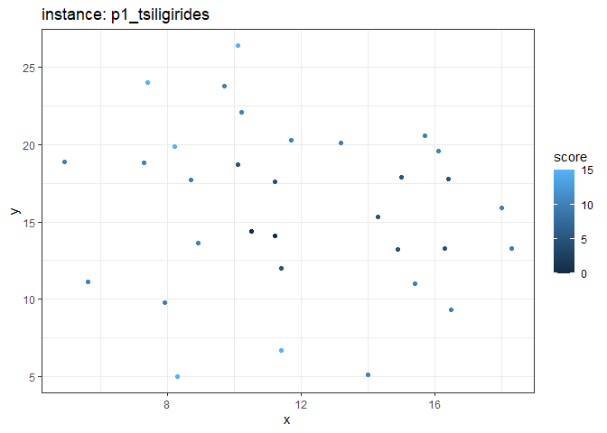

<!-- README.md is generated from README.Rmd. Please edit that file -->

# dz

<!-- badges: start -->

[](https://lifecycle.r-lib.org/articles/stages.html#experimental)
[](https://www.repostatus.org/#active)
<!-- badges: end -->

The goal of dz is to showcase algorithms developed to handle dynamic
zoning applications for the team-orienteering problem.

## Installation

You can install the development version of dz from
[GitHub](https://github.com/) with:

``` r
# install.packages("devtools")
devtools::install_github("Rosenkrands/dz")
```

## Test instances

There are 7 seven test instances included in the package. They can be
accessed with `dz::test_instances`.

``` r
length(dz::test_instances)
#> [1] 7
```

``` r
plot(dz::test_instances$p1_tsiligirides)
```


