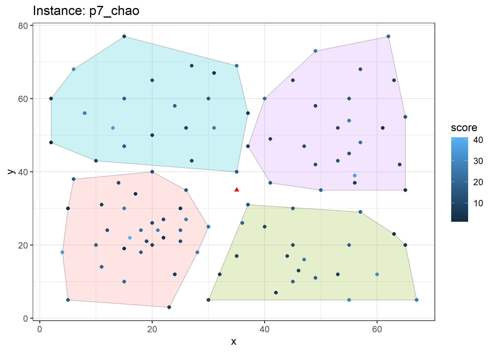
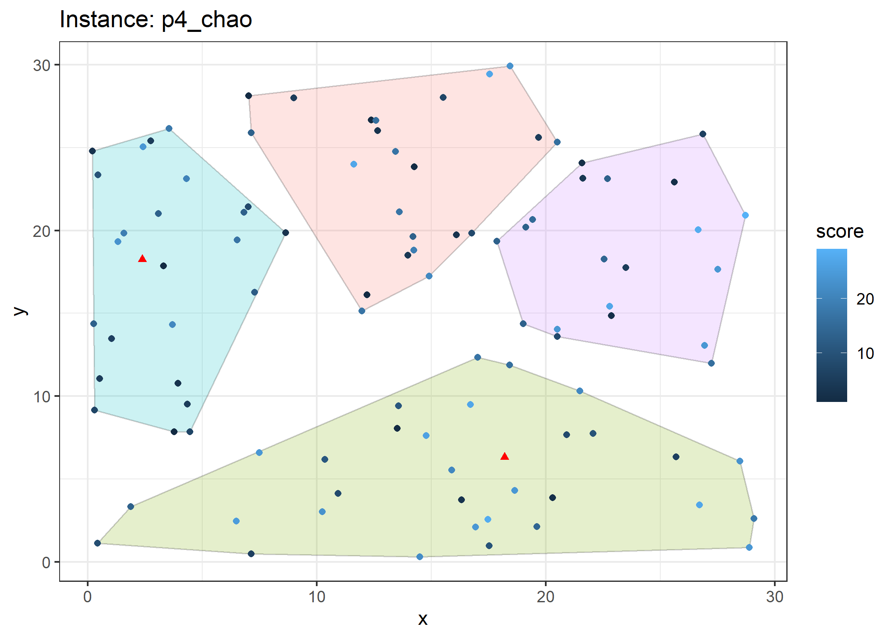
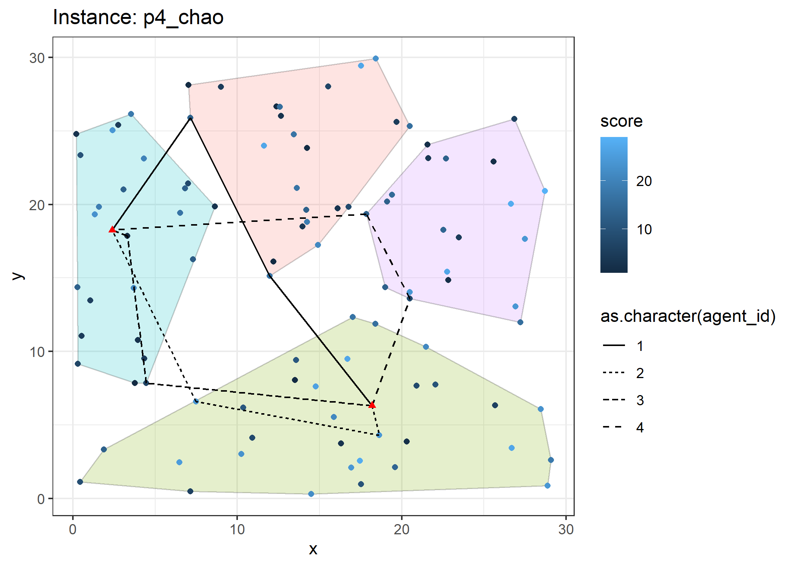

<!-- README.md is generated from README.Rmd. Please edit that file -->

# Dynamic Zoning

<!-- badges: start -->

[](https://lifecycle.r-lib.org/articles/stages.html#experimental)
[](https://www.repostatus.org/#active)
<!-- badges: end -->

The goal of dz is to showcase algorithms developed to handle dynamic
zoning applications for the team-orienteering problem.

## Installation

You can install the development version of dz from
[GitHub](https://github.com/) with:

``` r
# install.packages("devtools")
devtools::install_github("Rosenkrands/dz")
```

We can then load the library with the following command:

``` r
library(dz)
```

## Test instances

There are 7 seven test instances included in the package. They can be
accessed with `dz::test_instances`.

``` r
length(test_instances)
#> [1] 7
```

``` r
plot(test_instances$p7_chao, delaunay = F, voronoi = F)
```


## Clustering

With the `clustering` function we are able to decompose an instance into
a number of disjoint sets (disregarding the source node).

``` r
clust <- clustering(
  inst = test_instances$p7_chao,
  k = 4,
  cluster_method = "pam"
)

plot(clust)
#> Registered S3 methods overwritten by 'ggalt':
#>   method                  from   
#>   grid.draw.absoluteGrob  ggplot2
#>   grobHeight.absoluteGrob ggplot2
#>   grobWidth.absoluteGrob  ggplot2
#>   grobX.absoluteGrob      ggplot2
#>   grobY.absoluteGrob      ggplot2
```


## Routing

Given the an instance with clusters we are able to find a set of routes
using the `routing` function.

## Perform Clustering

``` r
inst <- test_instances$p4_chao
k <- 4

## Clustering part

# Save only the intermediate points for clustering
in_points <- inst$points |> dplyr::filter(point_type == "intermediate")

# Perform PAM clustering on the intermediate points and save the clustering vector
assign <- (cluster::pam(
  x = in_points |> dplyr::select(x, y),
  k = k,
  metric = "euclidean"
))$clustering

# Add the clustering vector to the intermediate points
in_points$zone <- assign

# Plot the instance with the PAM clustering
ggplot2::ggplot() +
  ggalt::geom_encircle(
    data = in_points,
    ggplot2::aes(x = x, y = y, group = zone, fill = as.character(zone)),
    s_shape = 1, expand = 0, alpha = 0.2
  ) +
  ggplot2::geom_point(
    data = inst$points |> dplyr::filter(point_type == "intermediate"),
    ggplot2::aes(x, y, color = score, shape = point_type)
  ) +
  ggplot2::geom_point(
    data = inst$points |> dplyr::filter(point_type == "terminal"),
    ggplot2::aes(x, y), color = "red", shape = 17
  ) +
  ggplot2::ggtitle(paste0("Instance: ", inst$name)) +
  ggplot2::theme_bw() +
  ggplot2::guides(
    shape = "none",
    fill = "none"
  )
```



``` r
## Routing part

# First we should find the closest point in each cluster to the source node
first_point <- inst$points |> 
  dplyr::mutate(dist_to_source = sqrt((x - x[1])^2 + (y - y[1])^2)) |> # Calculate the distance to the source node 
  dplyr::left_join(in_points |> dplyr::select(id, zone), by = c("id")) |> # Join with the intermediate points to get zone
  dplyr::group_by(zone) |> 
  dplyr::filter(dist_to_source == min(dist_to_source), # Get smallest distance by zone,
                !is.na(zone)) # Remove the source node

last_point <- inst$points |> 
  dplyr::mutate(dist_to_source = sqrt((x - x[nrow(inst$points)])^2 + (y - y[nrow(inst$points)])^2)) |> # Calculate the distance to the source node 
  dplyr::left_join(in_points |> dplyr::select(id, zone), by = c("id")) |> # Join with the intermediate points to get zone
  dplyr::group_by(zone) |> 
  dplyr::filter(dist_to_source == min(dist_to_source), # Get smallest distance by zone,
                !is.na(zone))

# Create a tibble to hold the routes
routes <- tibble::tibble(agent_id = 1:k) #, route = list(integer()))

routing <- function(agent_id) {
  # agent_id = 4
  route = integer()
  
  # First point is the source node
  route[1] <- 1
  
  # Determine first zone point for the agent
  route[2] <- first_point |> 
    dplyr::filter(zone == agent_id) |> 
    dplyr::pull(id)
  
  # Determine last point
  route[3] <- last_point |> 
    dplyr::filter(zone == agent_id) |> 
    dplyr::pull(id)
  
  # Last point is the terminal node
  route[4] <- nrow(inst$points)
  
  return(route)
}

routes <- routes |>
  dplyr::mutate(routes = lapply(as.list(routes$agent_id), routing))

# Determine segments from routes to plot
route_segments <- routes |> 
  tidyr::unnest(routes) |> 
  dplyr::group_by(agent_id) |> 
  dplyr::mutate(id_start = dplyr::lag(routes), id_end = routes) |> 
  dplyr::filter(!is.na(id_start)) |> 
  dplyr::select(-routes) |> 
  dplyr::inner_join(inst$points |> dplyr::select(id, x, y), 
                    by = c("id_start" = "id")) |> 
  dplyr::inner_join(inst$points |> dplyr::select(id, x, y), 
                    by = c("id_end" = "id"), suffix = c("","end"))

# Plot the segment on the existing plot
ggplot2::ggplot() +
  ggalt::geom_encircle(
    data = in_points,
    ggplot2::aes(x = x, y = y, group = zone, fill = as.character(zone)),
    s_shape = 1, expand = 0, alpha = 0.2
  ) +
  ggplot2::geom_point(
    data = inst$points |> dplyr::filter(point_type == "intermediate"),
    ggplot2::aes(x, y, color = score, shape = point_type)
  ) +
  ggplot2::geom_segment(
    data = route_segments,
    ggplot2::aes(x=x, y=y, xend=xend, yend=yend, linetype=as.character(agent_id))
  ) +
  ggplot2::geom_point(
    data = inst$points |> dplyr::filter(point_type == "terminal"),
    ggplot2::aes(x, y), color = "red", shape = 17
  ) +
  ggplot2::ggtitle(paste0("Instance: ", inst$name)) +
  ggplot2::theme_bw() +
  ggplot2::guides(
    shape = "none",
    fill = "none"
  )
```


