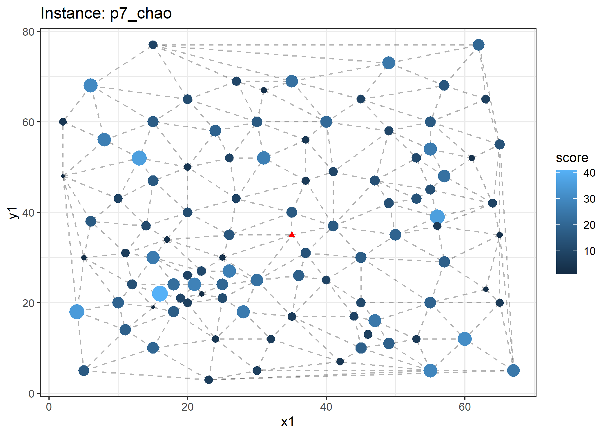
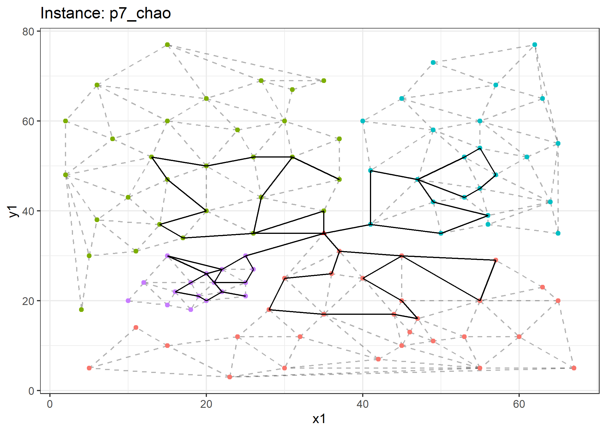

<!-- README.md is generated from README.Rmd. Please edit that file -->

# Dynamic Zoning

<!-- badges: start -->

[](https://lifecycle.r-lib.org/articles/stages.html#experimental)
[](https://www.repostatus.org/#active)
<!-- badges: end -->

The goal of dz is to showcase algorithms developed to handle dynamic
zoning applications for the team-orienteering problem.

## Installation

You can install the development version of dz from
[GitHub](https://github.com/) with:

``` r
# install.packages("devtools")
devtools::install_github("Rosenkrands/dz")
```

We can then load the library with the following command:

``` r
library(dz)
```

## Test instances

There are 7 seven test instances included in the package. They can be
accessed with `dz::test_instances`.

``` r
length(test_instances)
#> [1] 7
```

``` r
plot(test_instances$p7_chao, delaunay = F, voronoi = F)
```



## Clustering

With the `clustering` function we are able to decompose an instance into
a number of disjoint sets (disregarding the source node).

``` r
clust <- clustering(
  inst = test_instances$p7_chao,
  k = 4,
  cluster_method = "pam"
)

plot(clust)
#> Registered S3 methods overwritten by 'ggalt':
#>   method                  from   
#>   grid.draw.absoluteGrob  ggplot2
#>   grobHeight.absoluteGrob ggplot2
#>   grobWidth.absoluteGrob  ggplot2
#>   grobX.absoluteGrob      ggplot2
#>   grobY.absoluteGrob      ggplot2
```


## Routing

Given the an instance with clusters we are able to find a set of routes
using the `routing` function.

``` r
rout <- routing(
  clust = clust,
  routing_method = "random"
)

plot(rout)
```


