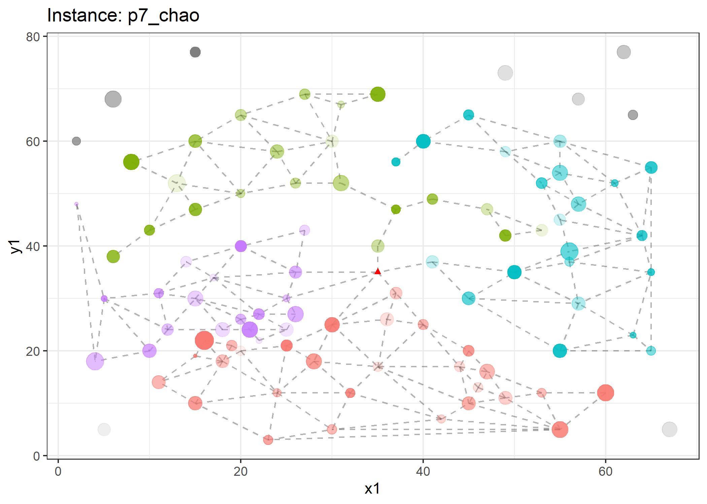
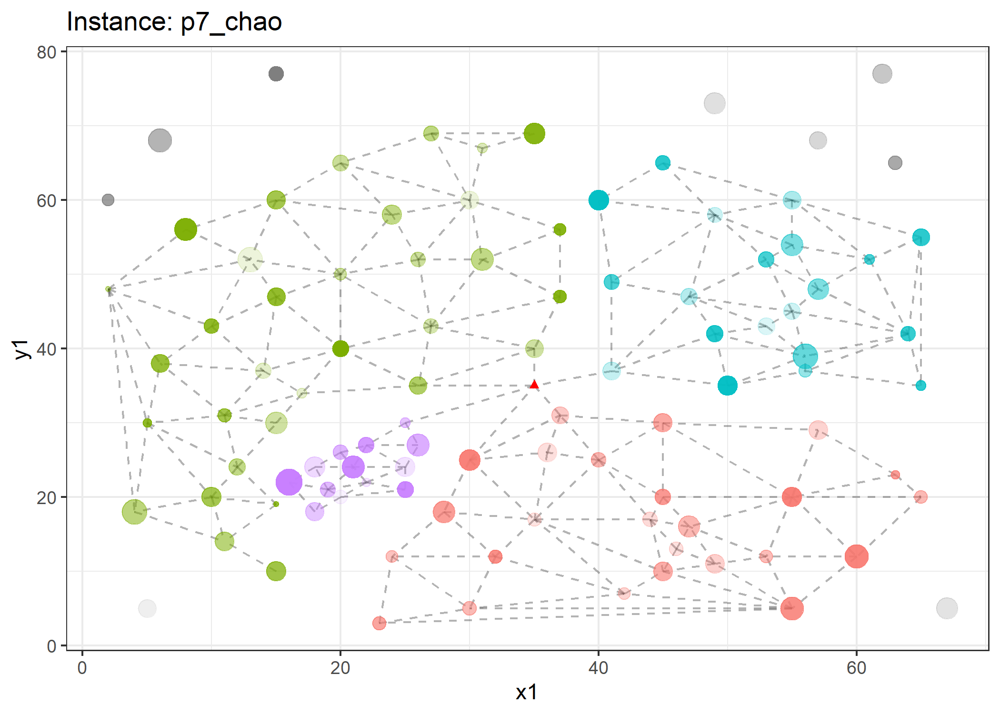

<!-- README.md is generated from README.Rmd. Please edit that file -->

# Dynamic Zoning

<!-- badges: start -->

[](https://www.repostatus.org/#active)
<!-- badges: end -->

The goal of dz is to showcase algorithms developed to handle dynamic
zoning applications for the team-orienteering problem.

## Installation

You can install the development version of dz from
[GitHub](https://github.com/) with:

``` r
# install.packages("devtools")
devtools::install_github("Rosenkrands/dz")
```

We can then load the library with the following command:

``` r
library(dz)
```

## Test instances

There are 7 seven test instances included in the package. They can be
accessed with `dz::test_instances`.

``` r
length(test_instances)
#> [1] 7
```

``` r
set.seed(123)
inst <- test_instances$p7_chao

plot(inst, delaunay = T)
```


## Clustering

With the `clustering` function we are able to decompose an instance into
a number of disjoint sets (disregarding the source node).

As of now there are two methods to perform the clustering; the greedy
approach and a local search approach. Below we can see the resulting
clusters from the greedy approach.

    #> unassigned points: 91
    #> unassigned points: 90
    #> unassigned points: 89
    #> unassigned points: 88
    #> unassigned points: 87
    #> unassigned points: 86
    #> unassigned points: 85
    #> unassigned points: 84
    #> unassigned points: 83
    #> unassigned points: 82
    #> unassigned points: 81
    #> unassigned points: 80
    #> unassigned points: 79
    #> unassigned points: 78
    #> unassigned points: 77
    #> unassigned points: 76
    #> unassigned points: 75
    #> unassigned points: 74
    #> unassigned points: 73
    #> unassigned points: 72
    #> unassigned points: 71
    #> unassigned points: 70
    #> unassigned points: 69
    #> unassigned points: 68
    #> unassigned points: 67
    #> unassigned points: 66
    #> unassigned points: 65
    #> unassigned points: 64
    #> unassigned points: 63
    #> unassigned points: 62
    #> unassigned points: 61
    #> unassigned points: 60
    #> unassigned points: 59
    #> unassigned points: 58
    #> unassigned points: 57
    #> unassigned points: 56
    #> unassigned points: 55
    #> unassigned points: 54
    #> unassigned points: 53
    #> unassigned points: 52
    #> unassigned points: 51
    #> unassigned points: 50
    #> unassigned points: 49
    #> unassigned points: 48
    #> unassigned points: 47
    #> unassigned points: 46
    #> unassigned points: 45
    #> unassigned points: 44
    #> unassigned points: 43
    #> unassigned points: 42
    #> unassigned points: 41
    #> unassigned points: 40
    #> unassigned points: 39
    #> unassigned points: 38
    #> unassigned points: 37
    #> unassigned points: 36
    #> unassigned points: 35
    #> unassigned points: 34
    #> unassigned points: 33
    #> unassigned points: 32
    #> unassigned points: 31
    #> unassigned points: 30
    #> unassigned points: 29
    #> unassigned points: 28
    #> unassigned points: 27
    #> unassigned points: 26
    #> unassigned points: 25
    #> unassigned points: 24
    #> unassigned points: 23
    #> unassigned points: 22
    #> unassigned points: 21
    #> unassigned points: 20
    #> unassigned points: 19
    #> unassigned points: 18
    #> unassigned points: 17
    #> unassigned points: 16
    #> unassigned points: 15
    #> unassigned points: 14
    #> unassigned points: 13
    #> unassigned points: 12
    #> unassigned points: 11
    #> unassigned points: 10
    #> unassigned points: 9
    #> unassigned points: 8
    #> unassigned points: 8
    #> unassigned points: 7
    #> unassigned points: 7
    #> unassigned points: 6
    #> unassigned points: 6
    #> unassigned points: 5
    #> unassigned points: 5
    #> unassigned points: 5
    #> unassigned points: 5
    #> unassigned points: 4
    #> unassigned points: 4
    #> unassigned points: 4
    #> unassigned points: 4
    #> unassigned points: 3
    #> unassigned points: 3
    #> unassigned points: 3
    #> unassigned points: 3
    #> unassigned points: 2
    #> unassigned points: 2
    #> unassigned points: 2
    #> unassigned points: 2
    #> unassigned points: 1
    #> unassigned points: 1
    #> unassigned points: 1
    #> unassigned points: 1
    #> unassigned points: 0
    #> unassigned points: 0
    #> unassigned points: 0



The local search approach tries to improve on the greedy approach using
an insertion operator. Resulting clusters from the local search approach
are shown below.



In the below animation we can see how the initial clustering in
iteratively improved using the local search approach.


The animation is created using `animate_local_search(clust_ls)`.

## Routing based clustering

``` r
# TODO...
```
